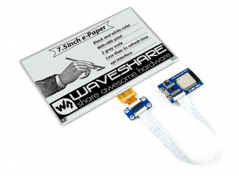
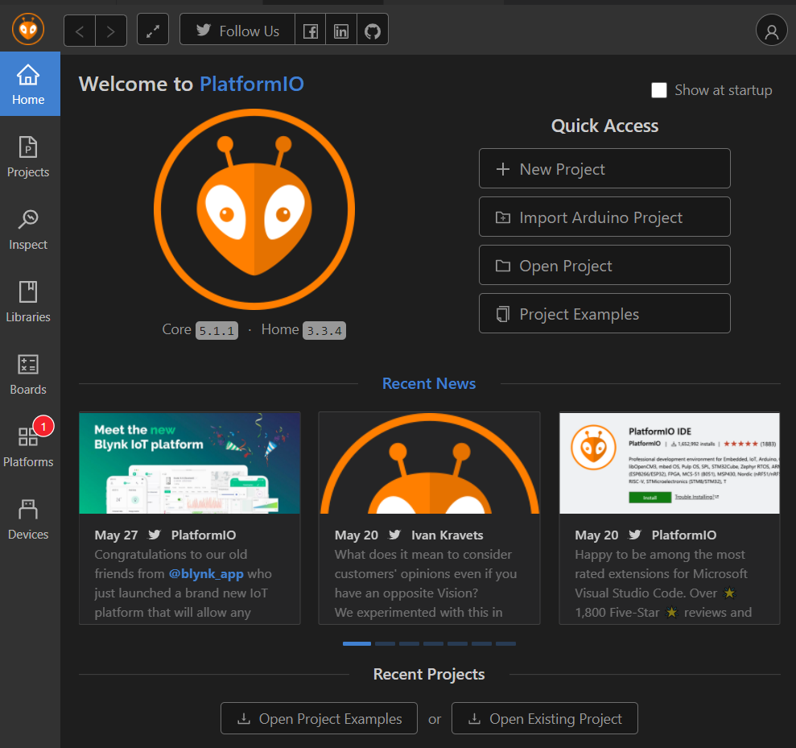

# eInkCalendarWithHitokoto 一言墨水屏待办日历\


[English](./README_en.md)

## 起因

一年前因为疫情滞留在家无法上学，所以闲得发慌想搞些事情。最早开始是看到闲鱼上有人放[ESP8266驱动的2.9寸的墨水屏时钟](https://oshwhub.com/duck/4-2-cun-mo-shui-ping-ri-li)，于是自己也做了一个，并且改了程序加了个flash，在里面加上了高考3500词进去拿回学校背单词。

同样的，看到小米有品里面有个[有品&秒秒测智能健康日历](https://www.xiaomiyoupin.com/detail?gid=120143&spmref=YouPinPC.$SearchFilter$1.search_list.1.66578030)，就很想自己弄一个。没想到鸽子本性难移，一鸽鸽到现在。


然后在上了大学的某一天看到了GitHub上张欣的repository[breakstring/eInkCalendarOfToxicSoul](https://github.com/breakstring/eInkCalendarOfToxicSoul)，觉得整挺好。


一不做二不休，说干就干。

## 方案

### 硬件

- **屏幕**：屏幕是真的贵，一个5.83inch的黑白双色硬质EPD墨水屏不加邮费230。买的时候要注意自己的5.83inch屏幕是哪个版本的，微雪官方有两个版本的[5.83inch e-Paper HAT](https://www.waveshare.net/wiki/5.83inch_e-Paper_HAT)，分辨率不一样。或者可以买三色的屏幕。


- **MCU**：当年想用树莓派驱动来着，发现树莓派又是一笔巨大的开支。原作者同样用ESP32，所以选择小一点的单片机，ESP32-WROOM-32。但是现在为了方便测试所以用了微雪官方的[E-Paper ESP32 Driver Board](https://www.waveshare.net/wiki/E-Paper_ESP32_Driver_Board)



需要注意的是，早期微雪的E-Paper ESP32 Driver Board是有一个开关。


而我买到的是俩开关。


根据微雪提供的[E-Paper ESP32 Driver Board原理图](https://www.waveshare.net/w/upload/8/80/E-Paper_ESP32_Driver_Board_Schematic.pdf)，ON/OFF那个开关是控制CP2012的供电的，关掉了就无法给ESP32烧录以及用USB供电；屏幕挡位如下图：


- **电源**：USB供电，我不喜欢电池，电池会老化爆炸。（将来可能会用四节五号电池驱动）

### 软件

- **集成开发环境**：PlatformIO IDE，基于Arduino库开发。值得注意的是PlatformIO需要Python环境，Pypi环境，可以自行百度搜索pip换源。



- **相关类库**: 在本软件开发中，主要用到了如下第三方库
    - [Adafruit GFX](https://github.com/adafruit/Adafruit-GFX-Library)
    - [GxEPD2](https://github.com/ZinggJM/GxEPD2):基于[Adafruit_GFX](https://github.com/adafruit/Adafruit-GFX-Library)库来驱动各种电子墨水屏。
    - [U8g2 for Adafruit GFX](https://github.com/olikraus/U8g2_for_Adafruit_GFX)：一套基于[U8g2](https://github.com/olikraus/U8g2)字体引擎来通过Adafruit GFX来显示文字的第三方库。
    - [u8g2_fontmaker](https://github.com/breakstring/u8g2_fontmaker)来配合U8g2 for Adafruit GFX.
    - [ArduinoJSON](https://arduinojson.org/) 这里有个很好用的网站[ArduinoJson Assistant](https://arduinojson.org/v6/assistant/)

- **相关服务**：
    - ~~专四单词：用的新东方-专四词根+联想记忆法(乱序版)~~
    - [一言API](https://v1.hitokoto.cn/)
    - [Todoist](https://www.todoist.com) 建议显示4个待办在【今天】里面就好了（我绝对不会说是因为buffer设置太大会硬复位导致问题的）
    - [IP地址查询](https://www.myip.la/)：用来通过当前设备的IP地址查询得知当前位置。具体可见 [src/MyIP.h](src/MyIP.h) 和 [src/MyIP.cpp](src/MyIP.cpp)
    - 字体：项目中的字体使用了[造字工房](https://www.makefont.com/)的部分非商用字体来生成。如您要使用，请确保在其[授权范围](https://www.makefont.com/authorization.html)内使用。
    - 天气服务：这里用了[和风天气开发平台](https://dev.qweather.com/)的服务。所以需要您前往注册账号并获取到自己的一个应用程序Key来替换[src/config.h](src/config.h)中的占位符。具体相关代码可以参见 [src/QWeather.h](src/QWeather.h) 和 [src/QWeather.cpp](src/QWeather.cpp)
```cpp
const String QWEATHER_API_KEY = "********************";
const String TODOIST_ACCESS_TOKEN = "************************";
```

### 总装

- 程序上传：上传文件分区镜像（就是那些天气图标什么的）和程序固件


### Todoist 设置


### 外观


### 特性

各位可以看到我后来用了7.5寸的屏幕显示，5.83寸属实是格局小了


### 待更新

- 番茄时钟 + 蜂鸣器
- 时间查看（局部刷新） + RTC
- SD卡 + 自定义字体 + 自定义文本显示
- ~~专四词汇表JSON化，不能写在头文件里面占用空间，通过网络获取~~
- ~~一言~~
- ~~待办事项~~

### 特别鸣谢

- [爱兰的工藤新一](https://github.com/AilansKudoShinichi) PCB设计