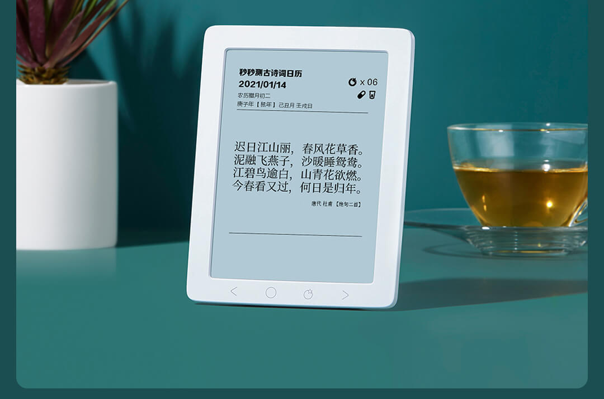
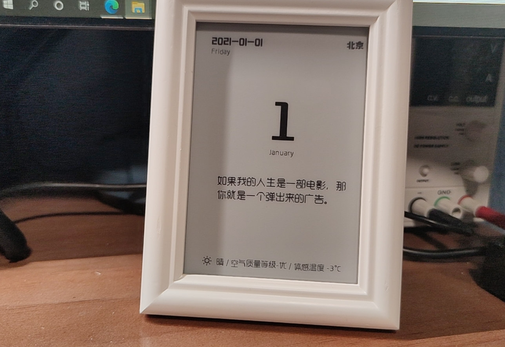
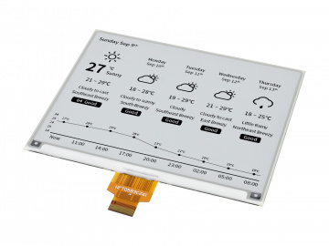
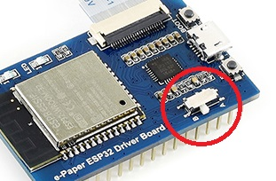
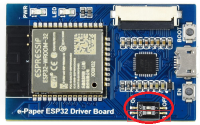
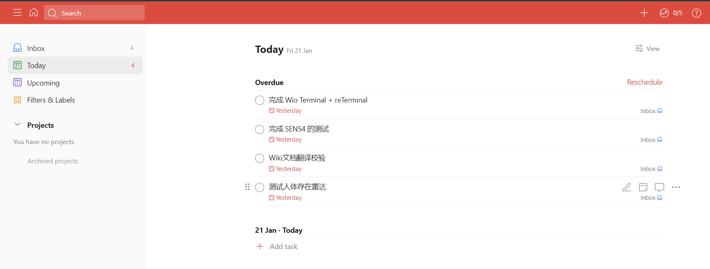
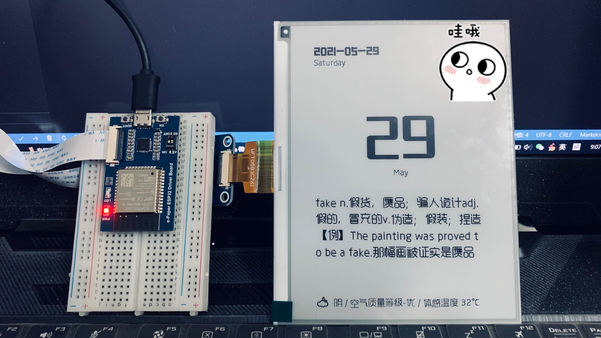

# eInkCalendarWithHitokoto eInk Calendar with Hitokoto and To do List 


[中文](./README.md)

## Onse upon a time...

A year befor I had had to stay at home for Online-Classing, and it was very boring. Then I saw a project on OshwHub [ESP8266 eInk Clock](https://oshwhub.com/duck/4-2-cun-mo-shui-ping-ri-li). So I made one and added English words list in the flash.

At the same time I saw an eInk device in Xiaomi Store [有品&秒秒测智能健康日历](https://www.xiaomiyoupin.com/detail?gid=120143&spmref=YouPinPC.$SearchFilter$1.search_list.1.66578030). I am eager to make the same product.



Eventually, I found a repository[breakstring/eInkCalendarOfToxicSoul](https://github.com/breakstring/eInkCalendarOfToxicSoul).



Just do it.

## Project

### Hardware

- **Display**: Display is freaking expensive, around 230 RMB(without shipping fee). **Caution:** There are two version of [Waveshare 5.83inch e-Paper HAT](https://www.waveshare.net/wiki/5.83inch_e-Paper_HAT), the resolutions are different.




- **MCU**: I used [Waveshare E-Paper ESP32 Driver Board](https://www.waveshare.net/wiki/E-Paper_ESP32_Driver_Board).


**Significantly**, on the early version of E-Paper ESP32 Driver Board there is only **one** button.



But I got a two-button version.



According to the [E-Paper ESP32 Driver Board schemetic](https://www.waveshare.net/w/upload/8/80/E-Paper_ESP32_Driver_Board_Schematic.pdf)，ON/OFF is the power switch，and the display switch is here：


- **Power**: USB Power(maybe I will use 4 AA batteries?)

### Software

- **IDE**: PlatformIO IDE


- **Repositories**: 
    - [Adafruit GFX](https://github.com/adafruit/Adafruit-GFX-Library)
    - [GxEPD2](https://github.com/ZinggJM/GxEPD2): based on [Adafruit_GFX](https://github.com/adafruit/Adafruit-GFX-Library)
    - [U8g2 for Adafruit GFX](https://github.com/olikraus/U8g2_for_Adafruit_GFX): based on [U8g2](https://github.com/olikraus/U8g2)
    - [U8g2_fontmaker](https://github.com/breakstring/u8g2_fontmaker)
    - [ArduinoJSON](https://arduinojson.org/)

- **Services**：
    - ~~TEM4 Words List: 新东方-专四词根+联想记忆法(乱序版)~~
    - [IP Address Search](https://www.myip.la/): codes in [src/MyIP.h](src/MyIP.h) & [src/MyIP.cpp](src/MyIP.cpp)
    - Fonts: from [MakeFont-造字工房](https://www.makefont.com/) non-commercial fonts. Please read the [License](https://www.makefont.com/authorization.html) before you using.
    - Weather API: [Qweather-和风天气开发平台](https://dev.qweather.com/). Please register an account and apply a KEY to replace the `*` in [src/config.h](src/config.h). Codes in  [src/QWeather.h](src/QWeather.h) & [src/QWeather.cpp](src/QWeather.cpp)
    - [Todoist ACCESS TOKEN](https://developer.todoist.com/appconsole.html)

    
```cpp
const String QWEATHER_API_KEY = "********************";
const String TODOIST_ACCESS_TOKEN = "************************";
```

### All Done

- Programme upload: 


### Todoist Setting



### Appearance




### Features

I used a 7.5 inches eInk display.


### To be updated

- Tomato clock + buzzer
- Time + RTC
- SD card + personalize fonts and texts
- ~~Words List JSON~~
- ~~Hitokoto~~
- ~~To do list~~

### Thanks

- [AilansKudoShinichi](https://github.com/AilansKudoShinichi) PCB设计